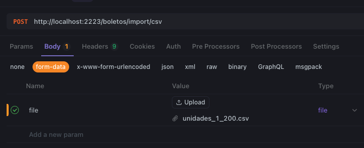
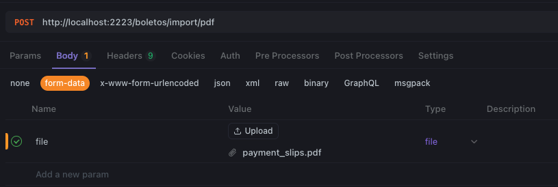
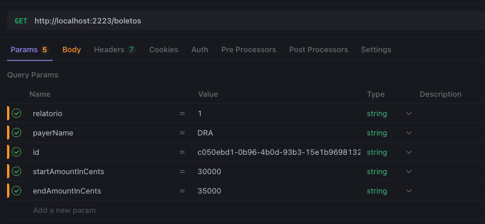
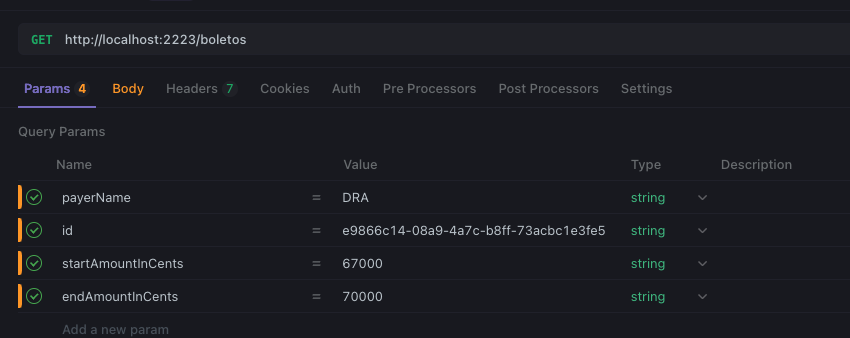

# Greenacesso API

Greenacesso API é um sistema de gerenciamento de pagamentos que permite importar, validar e gerar relatórios de boletos de pagamento.

## Funcionalidades

- Importação de boletos via CSV
- Validação de dados de pagamento
- Geração de relatórios em PDF
- Busca de boletos por diversos parâmetros (ID, valor, nome do pagador)

## Tecnologias

- TypeScript
- Node.js
- PDF-lib para geração de documentos PDF
- Arquitetura limpa com casos de uso e provedores

## Setup

### Pré-requisitos

- Node.js
- pnpm
- Docker
- Docker Compose

### Instalação

```bash
# Copie o arquivo .env.example para .env
cp .env.example .env

# Instale o gerenciador de pacotes
npm i -g pnpm

# Baixe dependências monorepo
pnpm install

# Suba os serviços de infraestrutura
docker compose up -d

# Execute migrações e seeds
pnpm --filter @greenacesso/database run db:migrate:dev
pnpm --filter @greenacesso/database run db:seed

# Inicie o servidor em modo dev (hot‑reload)
pnpm run dev
```

## Documentação

### Swagger

A documentação da API pode ser acessada através do Swagger.

```bash
http://localhost:2223/docs
```

Também tem na pasta `docs`

### Import CSV

Para importar boletos via CSV, utilize a rota `/boletos/import/csv`. O arquivo CSV deve seguir o formato abaixo:

Exemplo de requisição:

- Método: POST
- Endpoint: `/boletos/import/csv`
- Content-Type: multipart/form-data
- Corpo: arquivo CSV com o campo "file"



O arquivo CSV deve conter os seguintes campos:

- `nome`: Nome do pagador
- `unidade`: Identificação da unidade
- `valor`: Valor em centavos
- `linha_digitavel`: Linha digitável do boleto

Exemplo de arquivo CSV esta na pasta `docs/boletos.csv`

### Import PDF

Para importar boletos via PDF, utilize a rota `/boletos/import/pdf`. O arquivo PDF deve seguir o formato abaixo:

Exemplo de requisição:

- Método: POST
- Endpoint: `/boletos/import/pdf`
- Content-Type: multipart/form-data
- Corpo: arquivo PDF com o campo "file"



Exemplo de arquivo PDF esta na pasta `docs/boletos.pdf`

### Exportar relatório em PDF

Para exportar um relatório em PDF com os boletos filtrados, utilize a rota `/boletos`.

Exemplo de requisição:

- Método: GET
- Endpoint: `/boletos`
- Query Params:
  - `relatorio`: 1 (para exportar em PDF no formato base64)
  - `nome`: Filtrar por nome do pagador `(opcional)`
  - `id`: Filtrar por ID do boleto `(opcional)`
  - `startAmountInCents`: Valor mínimo em centavos `(opcional)`
  - `endAmountInCents`: Valor máximo em centavos `(opcional)`

O sistema retornará o PDF em formato base64 que pode ser convertido para visualização.



### Buscar boletos

Para buscar boletos, utilize a rota `/boletos`.

Exemplo de requisição:

- Método: GET
- Endpoint: `/boletos`
- Query Params:
  - `nome`: Filtrar por nome do pagador `(opcional)`
  - `id`: Filtrar por ID do boleto `(opcional)`
  - `startAmountInCents`: Valor mínimo em centavos `(opcional)`
  - `endAmountInCents`: Valor máximo em centavos `(opcional)`


